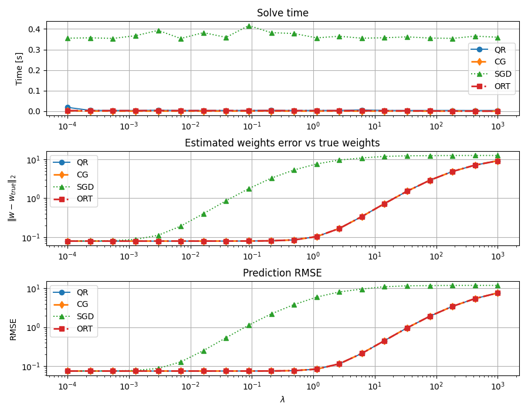
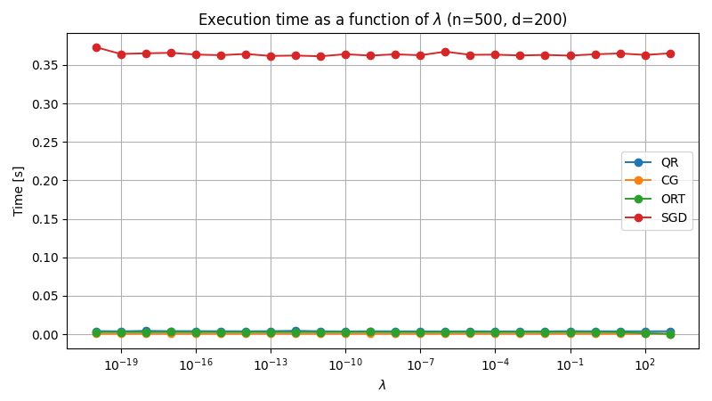
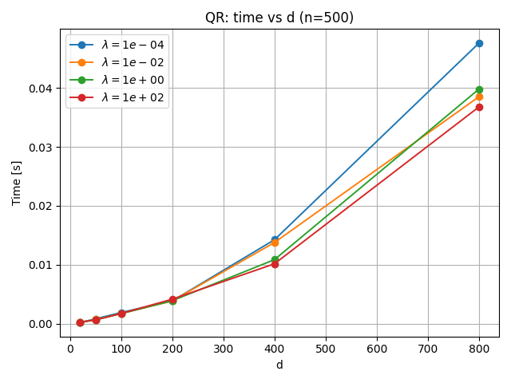
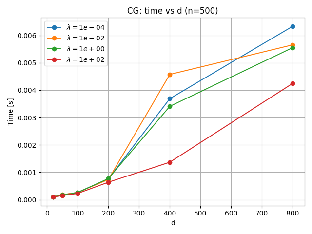
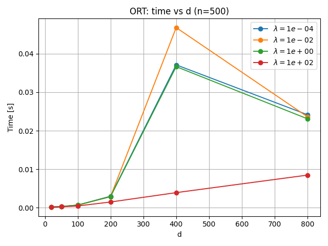
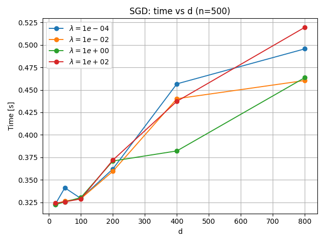
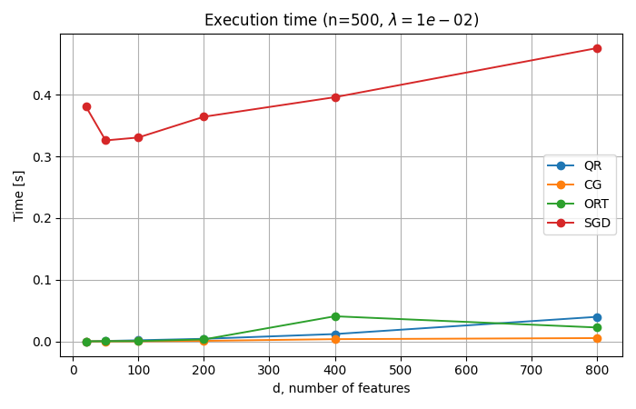

# Cracking Ridge Regression: QR, Conjugate Gradient, ORTOMIN, and SGD

This project is a Python reimplementation of a MATLAB study on Ridge Regression.  
The goal is to compare four different solvers for the same regularized least-squares problem:

- QR decomposition
- Conjugate Gradient (CG)
- ORTOMIN(1)
- Stochastic Gradient Descent (SGD)

The repository does not only implement the methods, but also benchmarks them across different values of the regularization parameter $\lambda$ and different feature dimensions $d$.

---

## 1. Problem statement

Ridge Regression solves the following optimization problem:

$\min_w \|Xw-y\|_2^2 + \lambda\|w\|_2^2$

where:

- $X \in \mathbb{R}^{n \times d}$ is the design matrix
- $y \in \mathbb{R}^{n}$ is the target vector
- $w \in \mathbb{R}^{d}$ is the weight vector
- $\lambda > 0$ is the regularization strength

The corresponding linear system is:

$(X^TX + \lambda I)w = X^Ty$

When $\lambda$ increases, the solution becomes more strongly regularized: weights are shrunk more aggressively, which can improve numerical stability but also increase bias.

---

## 2. Project goal

The purpose of this repository is to compare how different numerical strategies behave on the same Ridge Regression problem.

In particular, we want to evaluate:

- **execution time**
- **distance from the ground-truth weights**
- **prediction error (RMSE)**

The code uses synthetic data, so the true underlying weights are known. This makes it possible to measure not only predictive quality, but also how accurately each method recovers the actual parameter vector.

---

## 3. Experimental setup

The main script generates synthetic Gaussian data:

- number of samples: $n=500$
- initial number of features: $d=200$
- random seed: $1$
- noise level: $0.1$

Targets are generated as:

$y = Xw_{\text{true}} + 0.1\varepsilon$

with $\varepsilon \sim \mathcal{N}(0,I)$.

The main sweep is performed over:

$\lambda \in [10^{-4}, 10^3]$

using 20 logarithmically spaced values.

### Metrics

For each solver, the script records:

- **Time**: runtime in seconds
- **Weight error**: $\|w - w_{\text{true}}\|_2$
- **Prediction RMSE**: $\sqrt{\text{mean}((Xw-y)^2)}$

### SGD hyperparameters

The SGD baseline uses:

- learning rate: $10^{-3}$
- epochs: $200$
- shuffle: `True`

This implementation is intentionally simple and uses sample-by-sample updates.

---

## 4. Methods

### 4.1 QR decomposition

The QR-based solver uses the standard augmented formulation of Ridge Regression:

$\tilde{X} = \begin{bmatrix} X \\ \sqrt{\lambda}I \end{bmatrix}, \quad \tilde{y} = \begin{bmatrix} y \\ 0 \end{bmatrix}$

and then solves the least-squares problem through a reduced QR factorization.

This is typically the most numerically stable direct approach in the repository.

### 4.2 Conjugate Gradient

CG solves the symmetric positive definite system:

$(X^TX + \lambda I)w = X^Ty$

iteratively, without explicitly inverting the matrix.

It is usually attractive when the system is large and structured, and its cost depends on how quickly it converges.

### 4.3 ORTOMIN(1)

ORTOMIN(1) is another iterative Krylov-style method.  
Like CG, it solves the normal equations iteratively, but uses a different update rule for the search direction.

In practice, it can behave similarly to CG on some problems, but it may also be more sensitive to conditioning and stopping criteria.

### 4.4 Stochastic Gradient Descent

SGD updates the weights one sample at a time according to:

$w_{t+1} = w_t - \eta[(x_i^Tw - y_i)x_i + \lambda w]$

This is the most flexible method conceptually, but in this project it is also the most approximate one, since accuracy depends strongly on learning rate, number of epochs, and data ordering.

---

## 5. Main result: sweep over $\lambda$

Insert this image here:

### Analysis

This figure is the most important one in the project because it compares all four solvers on the same synthetic problem while varying $\lambda$.

#### Runtime
- **QR, CG, and ORTOMIN** are all very fast on this problem size.
- **SGD** is dramatically slower than the other three methods across the entire range of $\lambda$.
- The runtime of SGD is almost flat because its cost is dominated by the fixed number of epochs and per-sample Python loops, not by the value of $\lambda$.

#### Weight recovery
- **QR, CG, and ORTOMIN** almost overlap for small and moderate $\lambda$, which indicates that all three are solving the same problem correctly.
- As $\lambda$ becomes large, the weight error increases for all three methods. This is expected: stronger regularization biases the solution away from $w_{\text{true}}$.
- **SGD** performs much worse in this configuration. Its weight error starts increasing much earlier and reaches much larger values.

#### Prediction RMSE
- The RMSE trend matches the weight error trend.
- For small $\lambda$, **QR, CG, and ORTOMIN** provide nearly identical predictive performance.
- For large $\lambda$, prediction quality deteriorates because the model becomes overly regularized.
- **SGD** again underperforms substantially, showing that with the current hyperparameters it does not converge to a competitive solution.

### Main takeaway

On this benchmark, **QR, CG, and ORTOMIN are all reliable solvers**, while **SGD is clearly the weakest baseline in both speed and accuracy** under the chosen settings.

---

## 6. Runtime as a function of $\lambda$

Insert this image here:

### Analysis

This plot extends the regularization range down to extremely small values of $\lambda$.

The main observation is that:

- **runtime is almost insensitive to $\lambda$** for all methods in this experiment
- **SGD remains the slowest method by a large margin**
- **QR, CG, and ORTOMIN** stay in the millisecond regime

This is a useful result because it shows that, at least for this problem size, the computational burden is driven much more by the matrix size and solver structure than by the regularization strength itself.

Small fluctuations in the curves are expected and mostly reflect implementation details, random data draws, and timing noise.

---

## 7. Runtime as a function of feature dimension $d$

### 7.1 QR

Insert this image here:

**Analysis.**  
QR shows a clean and predictable growth in runtime as $d$ increases. This is consistent with the cost of dense matrix factorization, which becomes more expensive as the number of features grows.

### 7.2 Conjugate Gradient

Insert this image here:

**Analysis.**  
CG is the fastest method in this benchmark for most tested dimensions. Its runtime grows with $d$, but it remains very small overall. The exact runtime depends not only on matrix size, but also on convergence speed, which can vary with conditioning and $\lambda$.

### 7.3 ORTOMIN

Insert this image here:

**Analysis.**  
ORTOMIN is competitive at smaller dimensions, but its behavior is less regular. The visible spike around intermediate dimensions suggests that convergence is more sensitive to the specific problem instance, stopping tolerance, and iteration budget. This is one of the clearest differences between ORTOMIN and CG in the repository results.

### 7.4 SGD

Insert this image here:

**Analysis.**  
SGD is consistently much slower than the other methods. The reason is structural: the implementation performs many explicit Python-level updates, one sample at a time, over 200 epochs. Even though SGD avoids matrix factorizations, this simple implementation does not exploit vectorization and therefore remains expensive.

---

## 8. Combined runtime comparison vs dimension

Insert this image here:

### Analysis

This figure summarizes the four methods at fixed $\lambda=10^{-2}$ while varying $d$.

It highlights the ranking more clearly:

- **CG** is the fastest solver overall in this run
- **QR** is slower than CG, but still efficient and very regular in its scaling
- **ORTOMIN** is competitive, though less stable across dimensions
- **SGD** is by far the slowest method

This plot is probably the clearest one if the goal is to compare solver efficiency at increasing feature dimensionality.

---

## 9. Conclusions

The experiments support a fairly clear interpretation:

1. **QR is the most stable direct method** and provides a strong reference solution.
2. **CG is the best overall trade-off in this benchmark**, combining very low runtime with accuracy essentially identical to QR.
3. **ORTOMIN can match CG in accuracy**, but its runtime is more irregular.
4. **SGD is not competitive in this setup**. With the current learning rate and number of epochs, it is both slower and less accurate than the other methods.

In short, if the goal is to solve dense Ridge Regression accurately on problems of this scale, **CG and QR are the strongest choices in this repository**.

---
